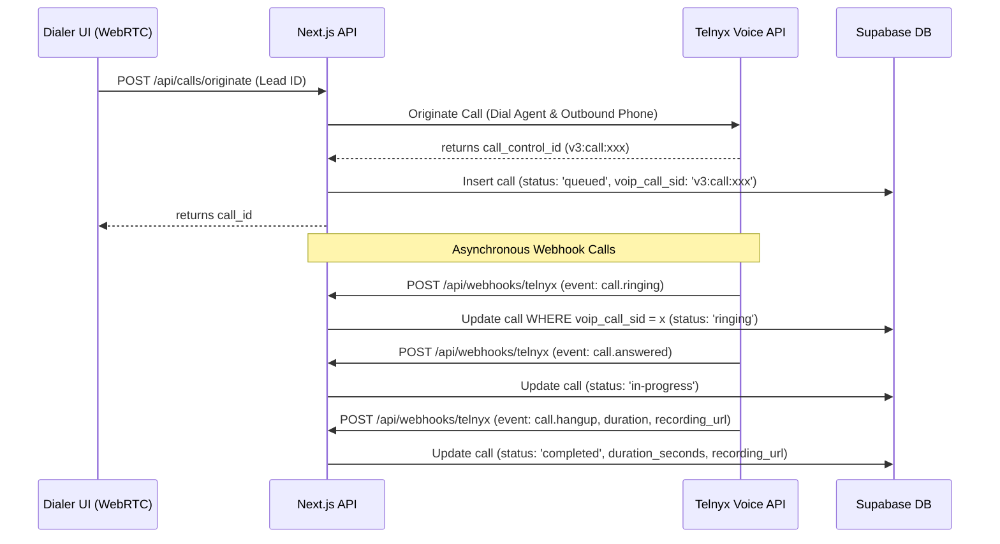

# Real Estate Power Dialer - Backend Architecture & Database Design

This document describes the backend architecture, database schema, multi-tenant security design, and VoIP integration strategy for the MVP Real Estate Power Dialer.

---

## 1. Table Relationships & Schema Design

Our PostgreSQL schema is optimized for multi-tenancy and high-speed write/read operations characteristic of power dialers. All business data tables contain a `company_id` column to serve as the partition key for tenant isolation.

### Entity-Relationship Details

```
  +---------------+
  |   companies   |
  +-------+-------+
          | 1
          |
          | 1..* (Cascade Delete)
  +-------v-------+
  |   profiles    | <---------------+ (Optional: agent_id)
  +-------+-------+                 |
          | 1                       |
          |                         |
          | 1..*                    |
  +-------v-------+                 |
  |   campaigns   | <-----------+   |
  +-------+-------+             |   |
          | 1                   |   |
          |                     |   |
          | 1..*                |   |
  +-------v--------+            |   |
  | campaign_leads |            |   |
  +-------+--------+            |   |
          | *                   |   |
          |                     |   |
          | 1                   |   |
  +-------v-------+             |   |
  |     leads     | <-------+   |   |
  +-------+-------+         |   |   |
          | 1               |   |   |
          |                 |   |   |
          | 1..*            |   |   |
  +-------v-------+         |   |   |
  |     notes     |         |   |   |
  +---------------+         |   |   |
                            |   |   |
  +-------------------------+---+---+ (For logging calls)
  |     calls     |
  +---------------+
```

### Table Explanations

1. **`companies`**: Holds tenant metadata. All entities trace back to a company.
2. **`profiles`**: Tied 1:1 with Supabase Auth (`auth.users`). Separates application data from system authentication data. Users are categorized as `admin` (can manage campaigns, agents, delete leads, view analytics) or `agent` (can view campaigns, make calls, take notes).
3. **`campaigns`**: Dictates dialing lists. Campaigns can be configured as `power` (calls next lead automatically when agent is ready) or `preview` (agent views lead before clicking to call).
4. **`leads`**: Central CRM record. The `custom_fields` `JSONB` column handles arbitrary key-value pairs (e.g. bedrooms, bathrooms, square footage, tax assessment) generated from real estate lists (MLS, listsource, etc.) without requiring table migrations.
5. **`campaign_leads`**: Bridges leads to campaigns. Includes a `status` ('pending', 'calling', 'completed', 'skipped') and `priority` to queue leads. A unique constraint on `(campaign_id, lead_id)` prevents the same lead from being dialed twice in one campaign.
6. **`calls`**: VoIP-centric calling history. Employs `voip_call_sid` to match asynchronously received webhooks from providers like Telnyx or Twilio.
7. **`notes`**: Enables agents to write text logs concerning a lead during or after calls.

---

## 2. Multi-Tenant Row-Level Security (RLS)

Multi-tenancy is enforced at the database layer using PostgreSQL RLS. Every table has RLS enabled, and queries are checked against the authenticated user's `company_id`.

### The Helper Functions Design
To avoid circular references and poor performance caused by subqueries inside RLS policies (e.g., querying `profiles` repeatedly to check `company_id`), we define two helper functions with `SECURITY DEFINER`:

1. `get_user_company_id()`: Returns the current authenticated user's `company_id`.
2. `is_company_admin()`: Returns `true` if the user's role is `admin`.

Because these run under `SECURITY DEFINER`, they execute with the privileges of the database owner (bypassing RLS for their internal lookups) and resolve instantly.

### Policy Enforcement Example (Campaigns)
```sql
-- View Policy
CREATE POLICY "Users can view campaigns in their company" ON public.campaigns
    FOR SELECT USING (company_id = public.get_user_company_id());

-- Modify Policy (Only Admins)
CREATE POLICY "Admins can create campaigns" ON public.campaigns
    FOR INSERT WITH CHECK (company_id = public.get_user_company_id() AND public.is_company_admin());
```
This guarantees that an agent cannot view campaigns belonging to other companies, and cannot write to campaigns even within their own company unless they are an admin.

---

## 3. VoIP Integration Preparedness (Telnyx/Twilio)

A dialer backend must be designed to handle asynchronous call flows, WebRTC clients, and real-time state changes. Our database is built with these integrations in mind.

### VoIP Database Elements in `calls` Table
- `voip_call_sid`: The unique call identifier issued by the VoIP provider (e.g., Telnyx Call Control ID `v3:call:xxxx` or Twilio Call SID `CAxxxx`). This is our search index for webhooks.
- `voip_provider`: Enables side-by-side usage or switching between Telnyx, Twilio, or Mock carriers.
- `sip_status_code`: Logs the exact SIP response code (e.g., `486` for Busy, `603` for Decline). This is essential in real estate to flag dead/wrong numbers automatically.

### Webhook Flow (Telnyx Call Control)
When an agent clicks "Call" in the dialer UI, the Next.js API sends a command to Telnyx to originate a call. Telnyx returns a Call Control ID which is stored in `calls.voip_call_sid`. As the call progresses, Telnyx fires webhooks to our backend:



---

## 4. Next.js API Structure Suggestion

We recommend a Next.js App Router API structure located in `/app/api`.

### API Directory Layout
```text
d:/dialer/
├── app/
│   └── api/
│       ├── auth/
│       │   └── signup/route.ts        # Handle tenant onboarding & profile creation
│       ├── campaigns/
│       │   ├── route.ts               # GET list, POST create campaigns
│       │   └── [id]/
│       │       ├── queue/route.ts     # GET next lead in campaign, POST status update
│       │       └── route.ts           # GET, PUT, DELETE individual campaign
│       ├── leads/
│       │   ├── route.ts               # GET list, POST manually create lead
│       │   └── import/route.ts        # POST CSV upload (parses custom_fields dynamically)
│       ├── calls/
│       │   ├── originate/route.ts     # POST starts a call (VoIP Integration)
│       │   ├── [id]/route.ts          # GET/PUT update call records
│       │   └── webhooks/
│       │       └── telnyx/route.ts    # POST receives webhook events from VoIP
│       └── notes/
│           └── route.ts               # POST add notes, GET lead notes
├── lib/
│   └── supabase.ts                    # Supabase Client configuration
└── package.json
```

### Next.js API Code Boilerplates

Below are concrete backend implementation drafts demonstrating how the backend handles CSV Parsing, Dialer Queuing, and Webhook updates.

#### A. CSV Leads Import: `app/api/leads/import/route.ts`
Designed to parse flexible CSV mappings (headers like "First Name", "First_Name", "Owner Name" map to standard DB columns, while anything else falls into `custom_fields`).

```typescript
import { NextRequest, NextResponse } from 'next/server';
import { createClient } from '@/lib/supabase/server'; // Server-side Supabase client with cookies
import { parse } from 'csv-parse/sync';

// Expected CSV Payload: 
// { 
//   campaignId: string, 
//   csvData: string, 
//   fieldMappings: { firstName: string, lastName: string, phone: string, email: string, address: string, ... } 
// }
export async function POST(req: NextRequest) {
  try {
    const supabase = createClient();
    
    // 1. Authenticate user and fetch tenant context (secured by Supabase token)
    const { data: { user }, error: authError } = await supabase.auth.getUser();
    if (authError || !user) {
      return NextResponse.json({ error: 'Unauthorized' }, { status: 401 });
    }

    // 2. Fetch tenant company_id via profiles
    const { data: profile, error: profileError } = await supabase
      .from('profiles')
      .select('company_id')
      .eq('id', user.id)
      .single();

    if (profileError || !profile) {
      return NextResponse.json({ error: 'Tenant profile not found' }, { status: 403 });
    }

    const { company_id } = profile;
    const { campaignId, csvData, fieldMappings } = await req.json();

    // 3. Parse CSV rows
    const records = parse(csvData, {
      columns: true,
      skip_empty_lines: true,
      trim: true,
    });

    const leadsToInsert = [];
    const campaignLeadsToInsert: any[] = [];

    for (const record of records) {
      // Extract standard fields based on dynamic UI mappings
      const phone = record[fieldMappings.phone]?.replace(/\D/g, ''); // Standardize to digits
      if (!phone) continue; // Skip leads without phones

      // Prepend US country code if missing
      const formattedPhone = phone.length === 10 ? `+1${phone}` : `+${phone}`;

      const firstName = record[fieldMappings.firstName] || null;
      const lastName = record[fieldMappings.lastName] || null;
      const email = record[fieldMappings.email] || null;
      const address = record[fieldMappings.address] || null;
      const city = record[fieldMappings.city] || null;
      const state = record[fieldMappings.state] || null;
      const zipCode = record[fieldMappings.zipCode] || null;

      // Everything not mapped goes into custom_fields JSONB
      const custom_fields: Record<string, any> = {};
      const mappedCsvHeaders = Object.values(fieldMappings);
      for (const [key, value] of Object.entries(record)) {
        if (!mappedCsvHeaders.includes(key)) {
          custom_fields[key] = value;
        }
      }

      leadsToInsert.push({
        company_id,
        first_name: firstName,
        last_name: lastName,
        phone: formattedPhone,
        email,
        address,
        city,
        state,
        zip_code: zipCode,
        custom_fields,
        status: 'New',
      });
    }

    // 4. Batch Upsert leads (ON CONFLICT on unique_company_phone DO UPDATE custom fields)
    const { data: insertedLeads, error: upsertError } = await supabase
      .from('leads')
      .upsert(leadsToInsert, { onConflict: 'company_id,phone' })
      .select('id, phone');

    if (upsertError || !insertedLeads) {
      return NextResponse.json({ error: 'Failed to upload leads database', details: upsertError }, { status: 500 });
    }

    // 5. Connect uploaded leads to the target campaign (if campaignId is specified)
    if (campaignId) {
      const campaignLeads = insertedLeads.map((lead) => ({
        company_id,
        campaign_id: campaignId,
        lead_id: lead.id,
        status: 'pending',
      }));

      // Ignore duplicates in campaign mapping (e.g. if lead is already in this campaign)
      const { error: junctionError } = await supabase
        .from('campaign_leads')
        .upsert(campaignLeads, { onConflict: 'campaign_id,lead_id' });

      if (junctionError) {
        return NextResponse.json({ error: 'Leads uploaded but failed to bind to campaign', details: junctionError }, { status: 500 });
      }
    }

    return NextResponse.json({ success: true, count: insertedLeads.length });
  } catch (err: any) {
    return NextResponse.json({ error: 'Internal Server Error', details: err.message }, { status: 500 });
  }
}
```

#### B. Dialer Queue: `app/api/campaigns/[id]/queue/route.ts`
Retrieves the next highest priority lead for the agent to call in the current campaign. Uses Postgres row locking (`select ... for update skip locked`) if running high concurrent dialers to prevent multiple agents from calling the same lead.

```typescript
import { NextRequest, NextResponse } from 'next/server';
import { createClient } from '@/lib/supabase/server';

export async function GET(
  req: NextRequest,
  { params }: { params: { id: string } }
) {
  try {
    const supabase = createClient();
    const campaignId = params.id;

    // 1. Authenticate user
    const { data: { user }, error: authError } = await supabase.auth.getUser();
    if (authError || !user) {
      return NextResponse.json({ error: 'Unauthorized' }, { status: 401 });
    }

    // 2. Fetch campaign lead in 'pending' status, sorted by priority and attempts
    // Note: For a high performance production dialer, SQL stored procedures with row-locking
    // are preferred. Below is the Supabase JS equivalent.
    const { data: queueItem, error: queueError } = await supabase
      .from('campaign_leads')
      .select(`
        id,
        status,
        call_attempts,
        priority,
        leads (
          id,
          first_name,
          last_name,
          phone,
          status,
          custom_fields
        )
      `)
      .eq('campaign_id', campaignId)
      .eq('status', 'pending')
      .order('priority', { ascending: false })
      .order('call_attempts', { ascending: true })
      .limit(1)
      .maybeSingle();

    if (queueError) {
      return NextResponse.json({ error: 'Database fetch failed', details: queueError }, { status: 500 });
    }

    if (!queueItem) {
      return NextResponse.json({ message: 'Queue is empty' }, { status: 200 });
    }

    // 3. Mark the lead status as 'calling' so no other agent pulls it
    await supabase
      .from('campaign_leads')
      .update({ status: 'calling' })
      .eq('id', queueItem.id);

    return NextResponse.json(queueItem);
  } catch (err: any) {
    return NextResponse.json({ error: 'Internal Server Error', details: err.message }, { status: 500 });
  }
}
```

#### C. VoIP Webhook Receiver: `app/api/calls/webhooks/telnyx/route.ts`
Updates call states and durations dynamically from Telnyx webhook payloads.

```typescript
import { NextRequest, NextResponse } from 'next/server';
import { createClient } from '@supabase/supabase-js'; // Use Service Role client to bypass RLS for incoming webhooks

// Webhooks originate from Telnyx and carry no user auth session.
// Initialize Supabase client using SUPABASE_SERVICE_ROLE_KEY to permit updates.
const supabaseAdmin = createClient(
  process.env.NEXT_PUBLIC_SUPABASE_URL!,
  process.env.SUPABASE_SERVICE_ROLE_KEY!
);

export async function POST(req: NextRequest) {
  try {
    const payload = await req.json();
    const event = payload.data;

    // Verify webhook signature here using Telnyx SDK (recommended for production)

    const callControlId = event.payload.call_control_id;
    const eventType = event.event_type;

    if (!callControlId) {
      return NextResponse.json({ received: true }); // Acknowledge non-call events
    }

    let statusUpdate = '';
    let duration = null;
    let recordingUrl = null;
    let sipStatusCode = event.payload.sip_status_code || null;

    switch (eventType) {
      case 'call.ringing':
        statusUpdate = 'ringing';
        break;
      case 'call.answered':
        statusUpdate = 'in-progress';
        break;
      case 'call.hangup':
        statusUpdate = 'completed';
        // Telnyx provides duration in seconds in hangup payload
        duration = event.payload.duration || null;
        break;
      case 'call.recording.saved':
        recordingUrl = event.payload.recording_urls?.mp3 || event.payload.recording_urls?.wav;
        break;
      default:
        return NextResponse.json({ received: true });
    }

    // Update database record matching the voip_call_sid
    if (statusUpdate) {
      const updateData: Record<string, any> = { status: statusUpdate };
      if (duration) updateData.duration_seconds = duration;
      if (sipStatusCode) updateData.sip_status_code = String(sipStatusCode);

      await supabaseAdmin
        .from('calls')
        .update(updateData)
        .eq('voip_call_sid', callControlId);
    }

    if (recordingUrl) {
      await supabaseAdmin
        .from('calls')
        .update({ recording_url: recordingUrl })
        .eq('voip_call_sid', callControlId);
    }

    return NextResponse.json({ success: true });
  } catch (err: any) {
    console.error('Webhook Error:', err.message);
    return NextResponse.json({ error: 'Webhook processing failed' }, { status: 500 });
  }
}
```
